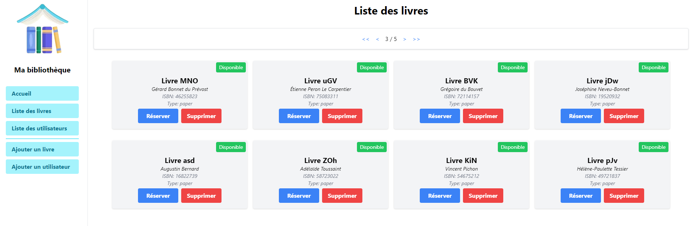
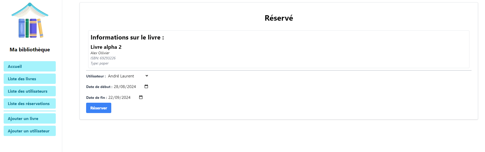
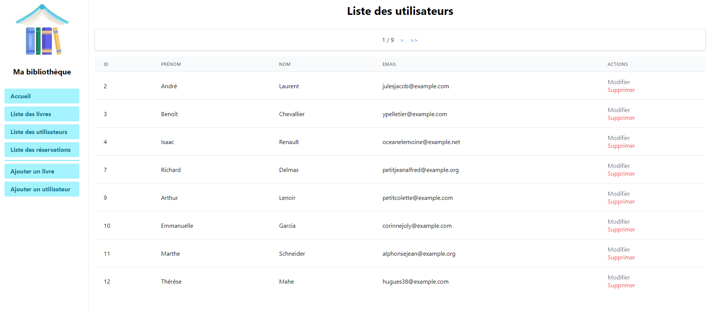
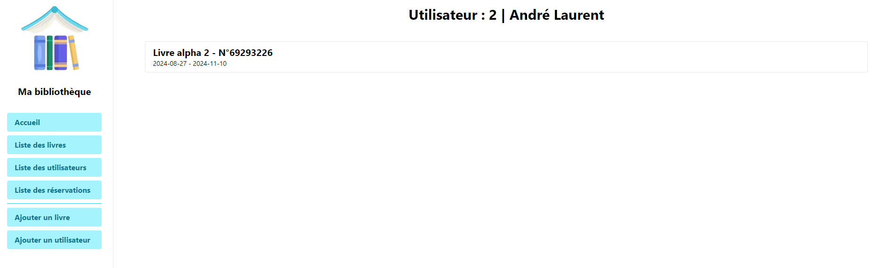

# Ma bibliothèque

## Objectif
Créer une application de gestion de livres.
- CRUD livre
- Statistiques
- Réservation de livre

## Technologies
- Python
- Flask
- TinyDB
- Tailwind CSS
- Architecture MVC

## Schéma de base de donnée

## Interface utilisateur

### Page d'accueil

### Page d'ajout de livre
- [x] Checker si ISBN déjà utilisé
- [x] Checker si titre, auteur, ISBN et type de livre sont renseignés

### Liste des livres
- [ ] Afficher que les livres disponibles
- [ ] Afficher que les livres non disponibles
- [x] Pagination
- [x] supprimer le livre et mouvements liés

### Details de livre
- [X] Afficher les informations du livre et les réservations

### Réservation de livre
- [X] Vérification de la disponibilité du livre
- [x] Vérification backend livre existant
- [x] Vérification backend utilisateur existant

### Liste des utilisateurs
- [x] Afficher les utilisateurs
- [x] Quantité de réservations
- [x] Supprimer un utilisateur et les réservations liées
- [x] Pagination

### Détails utilisateur

## Evolutions possibles
- [ ] Vue timeline d'un livre lors de la réservation
- [ ] Plus de KPI -> Chart nombre de réservations par jours
  - [ ] Quantité livre rendu en retard
- [ ] Afficher les réservations en cours d'un utilisateur (actuellement affiche toutes les réservations)
- [ ] Afficher les réservations passées d'un utilisateur (actuellement affiche toutes les réservations)
- [ ] système de tags pour les livres
  - [ ] Nouvelle table
- [ ] Système de notifications pour livre a renvoyé
- [ ] Date de création du livre et date de dernière modification
- [ ] Date de création de la réservation et date de dernière modification
- [ ] Date de création de l'utilisateur et date de dernière modification